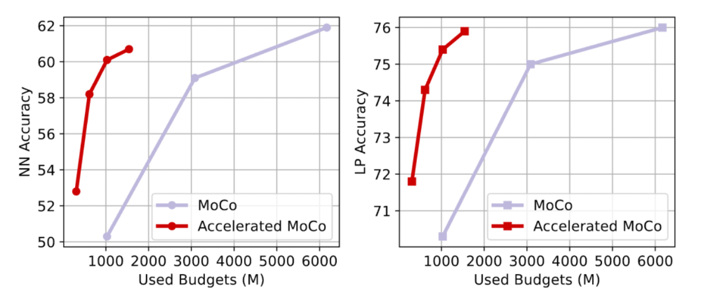
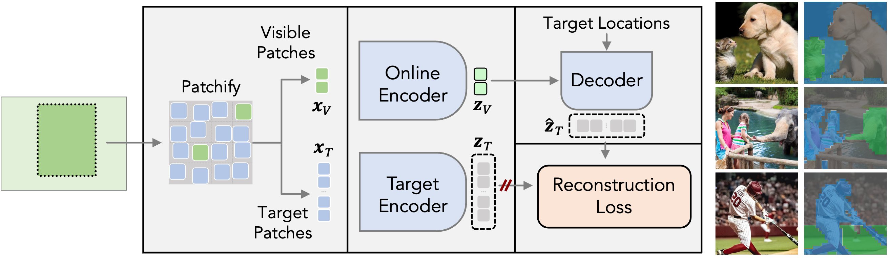
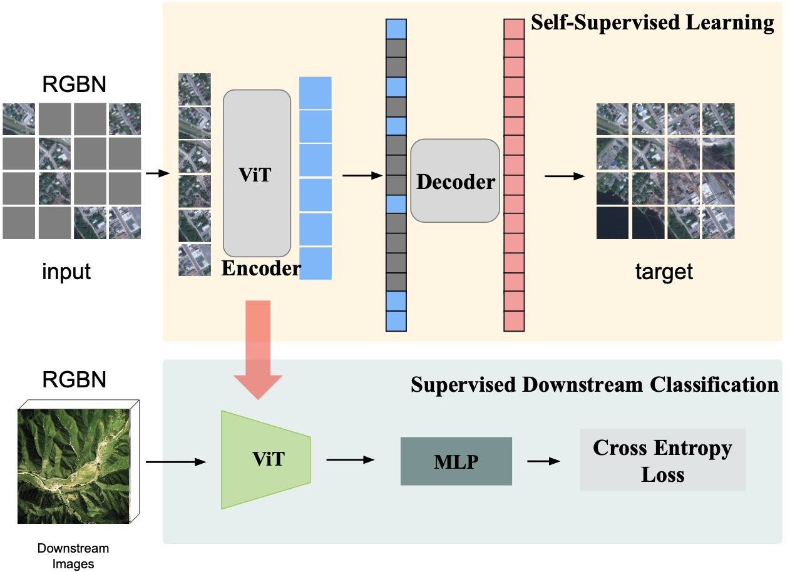
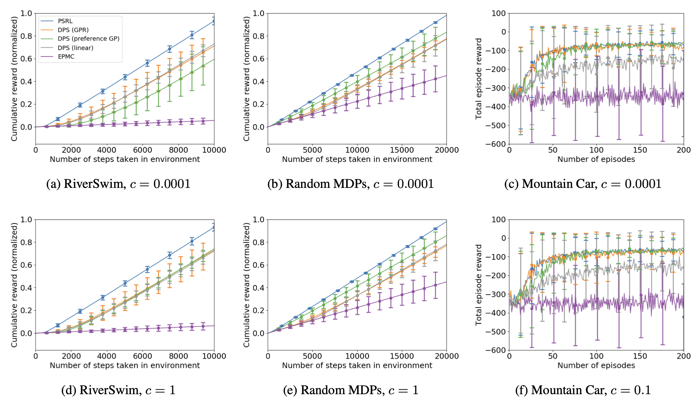
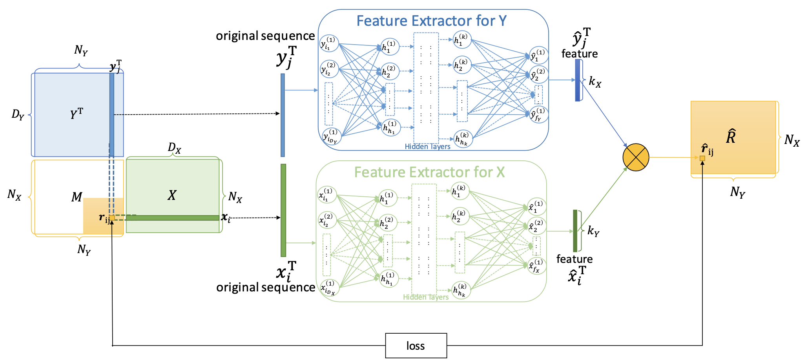
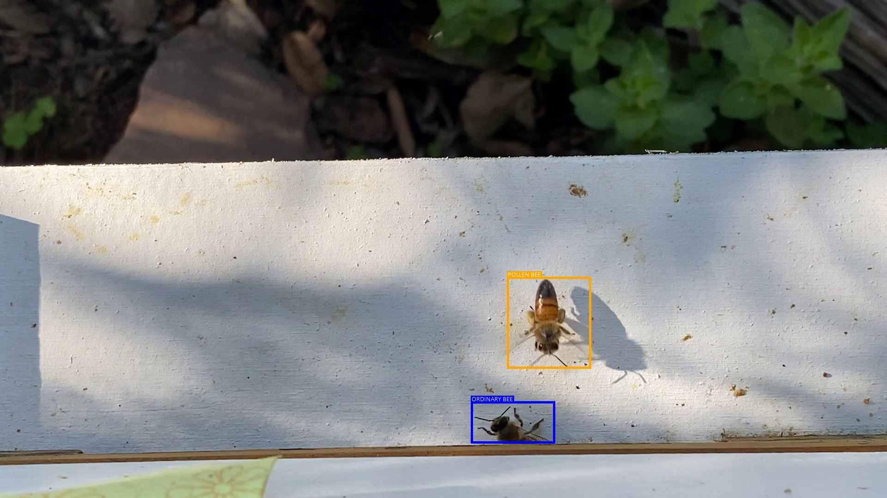

I am a PhD student in the Department of Computer Sciences at [University of Wisconsin Madison](https://www.cs.wisc.edu), advised by Prof. [Pedro Morgado](https://pedro-morgado.github.io). I obtained my Master's degree in Electrical Engineering from [Caltech](https://www.ee.caltech.edu), advised by Prof. [Yisong Yue](http://www.yisongyue.com) and Prof. [Pietro Perona](https://www.eas.caltech.edu/people/perona). 

My research has been primarily focused on visual representation learning without human supervison. 

<h2>News</h2>

**[July 2024]** Paper on [Latent MIM](https://github.com/yibingwei-1/LatentMIM) accepted by ECCV 2024.   
**[July 2024]** We've released [TrackVerse](https://github.com/MMPLab/TrackVerse), a large-scale video dataset.   

<h2>Publications</h2>
<table cellspacing="0" cellpadding="0">
<tr>
<td style="padding:0px;width:30%;vertical-align:middle">
  
</td>
<td style="padding:20px;width:70%;vertical-align:middle">  
  <h3>Accelerating Augmentation Invariance Pretraining</h3>
  <a href="https://scholar.google.com/citations?user=v4UwIYMAAAAJ&hl=en">Jinhong Lin</a>,<a href="https://cewu.github.io/">Cheng-En Wu</a>, <b>Yibing Wei</b>,  <a href="https://pedro-morgado.github.io/">Pedro Morgado</a>
   
  <em>NeurIPS</em>, 2024
   
  

    <a href="https://arxiv.org/abs/2410.22364">[paper]</a>
  
  
</td>
</tr>
<tr>
<td style="padding:0px;width:30%;vertical-align:middle">
  
</td>
<td style="padding:20px;width:70%;vertical-align:middle">  
  <h3>Towards Latent Masked Image Modeling for Self-Supervised
Visual Representation Learning</h3>
  <b>Yibing Wei</b>, <a href="http://www.cs.cmu.edu/~abhinavg/">Abhinav Gupta</a>,  <a href="https://pedro-morgado.github.io/">Pedro Morgado</a>
   
  <em>ECCV</em>, 2024
   
  

    <a href="https://arxiv.org/pdf/2407.15837">[paper]</a>
    <a href="https://github.com/yibingwei-1/LatentMIM">[code]</a>
    <a href="https://yibingwei-1.github.io/projects/lmim/lmim.html">[project page]</a>
  
  
</td>
</tr>    
<tr>
<td style="padding:0px;width:30%;vertical-align:middle;horizontal-align:middle">
  
</td>
<td style="padding:20px;width:70%;vertical-align:middle">  
  <h3>Multispectral Masked
Autoencoder for Remote Sensing Representation Learning</h3>
  <b>Yibing Wei</b>, <a href="https://www.linkedin.com/in/yangzc/">Zhicheng Yang</a>,  <a href="https://www.linkedin.com/in/hang-joey-zhou/">Hang Zhou</a>, <a href="https://www.linkedin.com/in/mei-han-a6b4b94/">Mei Han</a>,<a href="http://www.larry-lai.com/research.html">Jui-Hsin Lai</a>.
   
  <em>NeurIPS, WiML Workshop</em>, 2023
   
  

    <a href="https://docs.google.com/document/d/138cEkhXigmRdgPSj2Z3rYQ5y3YBTjTWu/edit?usp=sharing&ouid=113584289323171282848&rtpof=true&sd=true">[doc]</a>
  
  
</td>
</tr>    
<tr>
<td style="padding:0px;width:30%;vertical-align:middle">
  
</td>
<td style="padding:20px;width:70%;vertical-align:middle">  
  <h3>Dueling Posterior Sampling for
Preference-Based Reinforcement Learning</h3>
  <a href="https://ernovoseller.github.io">Ellen Novoseller</a>, <b>Yibing Wei</b>,  <a href="https://yanansui.com">Yanan Sui</a>, <a href="http://www.yisongyue.com">Yisong Yue</a>, and <a href="https://www.eas.caltech.edu/people/jburdick">Joel W Burdick</a>
   
  <em>UAI</em>, 2020
   
  

    <a href="https://arxiv.org/abs/1908.01289">[paper]</a> <a href="https://github.com/ernovoseller/DuelingPosteriorSampling">[code]</a>
  
  
</td>
</tr>    
<tr>
<td style="padding:0px;width:30%;vertical-align:middle">
  
</td>
<td style="padding:20px;width:70%;vertical-align:middle">  
  <h3>Deep Inductive Matrix Completion
for Biomedical Interaction Prediction</h3>
  <a href="https://haohanwang.github.io">Haohan Wang*</a>, <b>Yibing Wei*</b>, <a href="https://www.linkedin.com/in/mxin/">Mengxin Cao*</a>, <a href="https://scholars.cmu.edu/6103-min-xu">Min Xu</a>, <a href="">Wei Wu</a>, and <a href="https://www.cs.cmu.edu/~epxing/">Eric Xing</a>
   
  <em>BIBM</em>, 2019
   
  

    <a href="https://ieeexplore.ieee.org/document/8983275">[paper]</a>
  
  
</td>
</tr>
</table>

<h2>Projects</h2>
<table cellspacing="0" cellpadding="0">
<tr>
<td style="padding:0px;width:30%;vertical-align:middle">
  
</td>
<td style="padding:20px;width:70%;vertical-align:middle">  
  <h3>🐝 Honeybee Computational Visual System</h3>
  - A <b>visual system</b> to detect, track, and count honeybees in the real-world environments. <a href="https://www.youtube.com/watch?v=e2AaZVANBX8">[Demo]</a>  
  - Hierarchical crowdsourcing algorithm for <b>dense objects annotation</b> 
    <a href="https://github.com/yibingwei-1/Caltech-Honeybee">[Code]</a>
</td>
</tr>
</table>

<h2>Awards</h2>

- Beijing Outstanding Graduates (with honors), 2019
- National Scholarship for Outstanding Students, 2016

<h2>Teaching</h2>

@ UW-Madison  
CS/ECE 766 - Computer Vision (Spring 2024)  
CS 769 - Advanced Natural Language Processing (Spring 2022) 
CS 220 - Data Programming 1(Fall 2021) 

@ Caltech 
ACM 104 - Applied Linear Algebra (Fall 2020)  
IDS 158 - Fundamentals of Statistical Learning (Spring 2020)  
Ph1b - Electromagnetism (Applications) (Winter 2020)  
